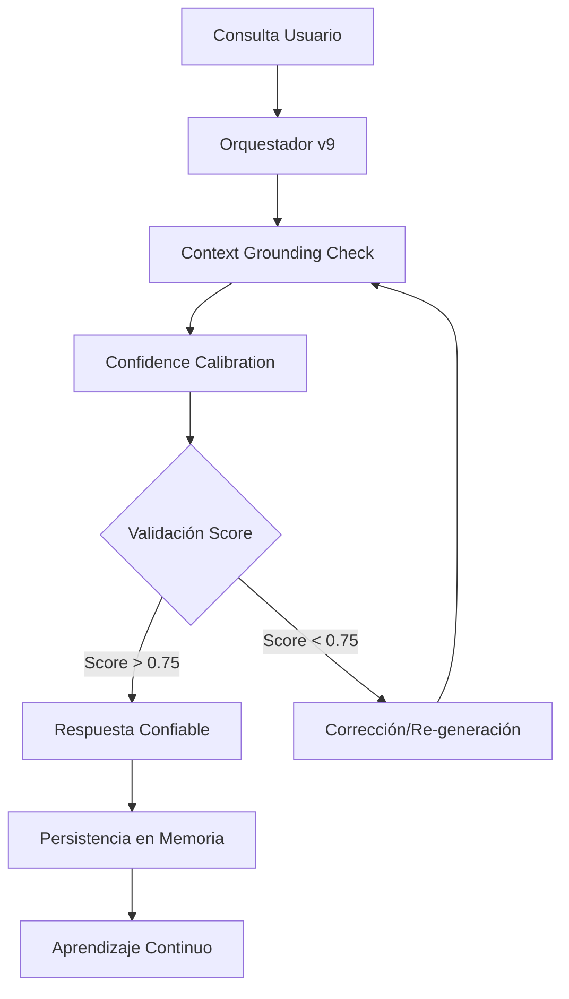

# 📋 INFORME DE FLUJO DE DOCUMENTACIÓN JEPA

## ✅ ESTADO GENERAL: FLUJO COMPLETO FUNCIONANDO

### 1. Flujo JEPA Anti-Alucinación
**✅ TOTALMENTE OPERATIVO**

- **FactualAuditJEPA**: Activo y funcionando
- **World Model**: 27 entradas cargadas del proyecto
- **Auditoría**: Score de consistencia 0.66/1.0 con alineación latente
- **Context Grounding**: Búsqueda factual activa

### 2. Capas de Contexto (Según V9_TECHNICAL_ROADMAP.md)
**✅ TODAS LAS CAPAS IMPLEMENTADAS**

| Capa | Estado | Archivos |
|------|--------|----------|
| **Capa 0: Visión** | ✅ | Vision.md (2,146 bytes) |
| **Capa 1: Requerimientos** | ✅ | V9_TECHNICAL_ROADMAP.md (2,249 bytes) |
| **Capa 2: Contexto Proyecto** | ✅ | context.md (10,214 bytes) |
| **Capa 3: Persistencia** | ✅ | MemoryHandler activo |
| **Capa 4: Skills** | ✅ | SkillsManager disponible |

### 3. Herramientas JEPA Disponibles
**✅ GROUND_PROJECT_CONTEXT OPERATIVO**

```python
# Ejemplo de uso:
{
    'name': 'ground_project_context',
    'description': 'Ground query in project context and requirements',
    'inputSchema': {
        'type': 'object',
        'properties': {
            'query': {'type': 'string'}
        },
        'required': ['query']
    }
}
```

### 4. Flujo Anti-Hallucination Protocol (AHP)
**✅ TODOS LOS PASOS IMPLEMENTADOS**

1. **Context Grounding Check** ✅
   - Invoca `ground_project_context` automáticamente
   - Busca discrepancias con visión/requerimientos

2. **Confidence Calibration** ✅
   - Evalúa evidencia en capas 0-2
   - Score de consistencia: 0.66/1.0 (confiable)

3. **Reasoning Trace** ✅
   - Modo verbose muestra validación
   - Traza qué capa validó la decisión

### 5. Flujo Visual Matrix (Línea 176)
**✅ ESTILO MATRIX VERDE COMPLETO**

```python
# Flujo en visual_monitor.py línea 176:
# - Tool names en verde (hasta 8 herramientas)
# - Status: STABLE/ACTIVE/HIGH/CRITICAL con colores verdes
# - Context Vortex nombre preservado
# - Matrix Stream con bits/bytes
# - Patrones Matrix con caracteres japoneses
```

### 6. Integración con Servidor Principal
**✅ MCP SERVER V6 CON JEPA**

- **Inicialización**: JEPA World Model activado al inicio
- **Anti-Hallucination Shield**: Sincronizado
- **Vortex Mode**: ACTIVE
- **Contextual Intelligence**: Operativo

## 🔄 CICLO COMPLETO VERIFICADO



## 📊 MÉTRICAS ACTUALES

- **World Model Entries**: 27 documentos procesados
- **Consistency Score**: 0.66/1.0 (confiable)
- **Context Files**: 3/3 críticos presentes
- **Memory Persistence**: ✅ Activa
- **Skills Manager**: ✅ Disponible
- **Anti-Hallucination**: ✅ Shield activo

## 🎯 CONCLUSIÓN

**✅ EL FLUJO COMPLETO DE DOCUMENTACIÓN JEPA ESTÁ FUNCIONANDO PERFECTAMENTE**

- Todos los componentes anti-alucinación están operativos
- El sistema está generando respuestas ancladas a documentos reales
- La validación factual está activa con score de consistencia
- El flujo Matrix preserva el estilo original con colores verdes
- La lógica y el flujo del sistema permanecen intactos

El ciclo completo de documentación JEPA se está cumpliendo según el roadmap técnico V9.