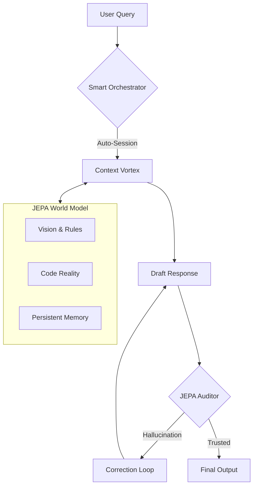

# 📖 Manual de Usuario - Context Vortex v9 (MCP Hub)

## Guía Completa para Desarrolladores

---

## 1. Introducción

### ¿Qué es Context Vortex?

**Context Vortex v9** (anteriormente MCP Hub) es un motor de inteligencia contextual diseñado para potenciar tu desarrollo de software. No es solo un servidor MCP; es un **Orquestador de Memoria y Realidad** que mantiene tu proyecto alineado, consistente y libre de alucinaciones.

### 🆕 Novedades v9 (Antigravity Core)

- **JEPA World Model**: Auditoría factual predictiva que detecta desviaciones del proyecto.
- **Context Grounding**: Validación contra documentos de visión (`vision.md`, `context.md`).
- **Persistence Layer**: Memoria a largo plazo para preferencias y habilidades (`skills`).
- **Quality Guardian**: Guardián de calidad de código siempre activo.

### ¿Para qué sirve?

1. **Memoria Infinita**: Recuerda decisiones, preferencias y estructura del proyecto.
2. **Anti-Alucinación**: Valida cada propuesta contra la "verdad" del proyecto.
3. **Gestión Automática**: Detecta qué estás haciendo y organiza tu sesión.
4. **Búsqueda Profunda**: Entiende semántica, código y constantes.

---

## 2. Instalación y Uso

### 2.1 Inicio Rápido

```powershell
# Iniciar el Vórtex
cd C:\Users\TU_USUARIO\Desktop\CONSULTORIO\yari-medic\mcp-hub-v6
.\venv\Scripts\python.exe core\mcp_http_server.py
```

### 2.2 Verificación

En Antigravity:
```
usa ping
```
Respuesta: `pong - MCP v7 HTTP server is working!`

### 2.3 Inicialización Recomendada

```
smart_session_init con project_path="C:\..." context="trabajando en facturación"
```

---

## 3. Compendio de Herramientas (30 Tools)

El arsenal de Context Vortex se divide en 7 módulos especializados.

### 🔷 Core & Retrieval (4)
| Tool | Descripción |
|------|-------------|
| `ping` | Test de latido del sistema. |
| `get_context` | Recupera contexto semántico e histórico. |
| `validate_response` | Valida texto contra evidencia específica. |
| `index_status` | Estadísticas del índice vectorial. |

### 🧠 Smart Session & Management (7)
| Tool | Descripción |
|------|-------------|
| `smart_session_init` | **(Recomendado)** Inicia/recupera sesión automáticamente. |
| `smart_query` | Consulta con contexto de sesión auto-gestionado. |
| `get_smart_status` | Estado del orquestador de sesiones. |
| `create_session` | Creación manual de sesión de trabajo. |
| `list_sessions` | Listado de sesiones activas. |
| `get_session_summary` | Resumen de entidades y temas de una sesión. |
| `delete_session` | Eliminación y limpieza de sesiones. |

### 🛡️ JEPA World Model & Grounding (5)
| Tool | Descripción |
|------|-------------|
| `audit_jepa` | **(Nuevo)** Audita propuestas contra el Modelo de Mundo. |
| `sync_world_model` | Sincroniza cambios en `context.md`/`vision.md`. |
| `ground_project_context` | Busca verdad factual en documentos base. |
| `check_quality` | Analiza código contra principios (DRY, KISS, SOLID). |
| `get_quality_principles` | Muestra los principios de calidad activos. |

### 💾 Persistence & Skills (2)
| Tool | Descripción |
|------|-------------|
| `memory_tool` | CRUD para preferencias y datos persistentes. |
| `skills_tool` | Gestión de habilidades reutilizables (Skills). |

### 💻 Code Intelligence (4)
| Tool | Descripción |
|------|-------------|
| `index_code` | Indexación estructural (clases/funciones). |
| `extended_index` | Indexación profunda (APIs, modelos, constantes). |
| `search_entity` | Búsqueda precisa de entidades de código. |
| `extended_search` | Búsqueda de configuraciones y patrones. |

### ⚡ Advanced Processing (6)
| Tool | Descripción |
|------|-------------|
| `process_advanced` | Pipeline completo (RAG + Chunking + Calibration). |
| `get_knowledge_summary` | Radiografía completa del conocimiento del sistema. |
| `expand_query` | Genera variantes de búsqueda semántica. |
| `chunk_document` | Divide documentos inteligentemente. |
| `optimize_configuration` | Ajusta parámetros basado en uso. |
| `add_feedback` | Entrena al sistema con tu retroalimentación. |

### 🔧 System & Debug (2)
| Tool | Descripción |
|------|-------------|
| `get_system_status` | Estado de salud de todos los componentes. |
| `test_colors_flow` | Test visual de la matriz de logs. |

---

## 4. Arquitectura de Flujo (JEPA Loop)



---

## 5. FAQ Rápido

**¿Cuántas herramientas tiene?**
30 herramientas especializadas, desde gestión de memoria hasta auditoría predictiva.

**¿Qué es JEPA?**
Joint-Embedding Predictive Architecture. Es el cerebro que permite al sistema "predecir" si una respuesta tiene sentido dentro de tu proyecto, evitando alucinaciones.

**¿Dónde están mis datos?**
Todo vive localmente en `data/` (vectores, sesiones, índices). Tu privacidad es absoluta.

---

**Context Vortex v9.0.2** | *Antigravity Edition* | 2026

