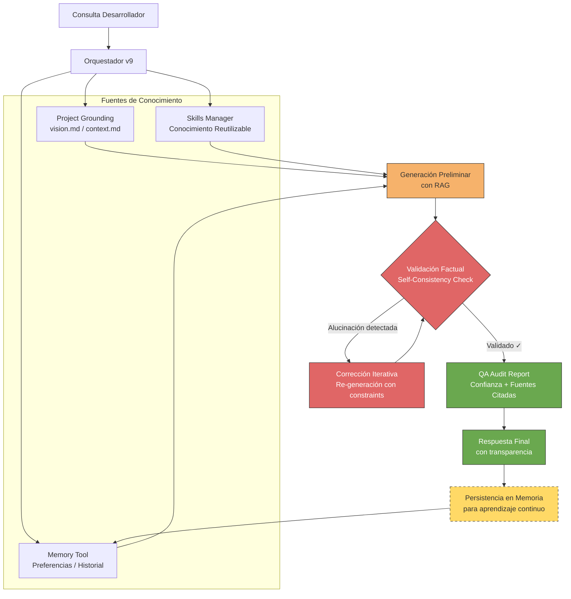

# 📖 Manual de Usuario - MCP Hub v9.0.2 (Antigravity Edition)

## Guía Completa para Desarrolladores

---

## 1. Introducción

### ¿Qué es MCP Hub v8?

MCP Hub v8 es un servidor de **Protocolo de Contexto de Modelo (MCP)** con **Smart Session Management**. Actúa como tu memoria persistente durante el desarrollo de software, ahora con gestión INTELIGENTE y AUTOMÁTICA de sesiones.

### 🆕 Novedades en V9 (Antigravity Core)

- **AHP (Anti-Hallucination Protocol)**: Grounding factual obligatorio contra requerimientos.
- **Project Vision Grounding**: Conciencia total de los objetivos del proyecto (`project_context/`).
- **Claude-like Memory Tool**: Persistencia de largo plazo para preferencias y decisiones.
- **Skills Manager**: Paquetes de conocimiento semántico reutilizables.
- **Agnostic Core**: Separación total entre el motor de contexto y la lógica de negocio.

### ¿Para qué sirve?

1. **Memoria entre sesiones**: No pierdas el contexto cuando cierras el IDE
2. **Conocimiento del código**: El sistema conoce tus funciones y clases
3. **Búsqueda inteligente**: Encuentra información con queries naturales
4. **Anti-alucinación**: Valida respuestas contra evidencia real
5. **🆕 Gestión automática**: No necesitas crear sesiones manualmente

---

## 2. Primeros Pasos

### 2.1 Requisitos Previos

- ✅ Python 3.9 o superior
- ✅ Windows 10/11
- ✅ Antigravity IDE instalado
- ✅ MCP Hub v8 instalado


### 2.2 Instalación Rápida

```powershell
# 1. Ir al directorio
cd C:\Users\TU_USUARIO\Desktop\CONSULTORIO\yari-medic\mcp-hub-v7

# 2. Activar entorno virtual
.\venv\Scripts\activate

# 3. Instalar dependencias (si es la primera vez)
pip install -r requirements.txt
pip install mcp
```

### 2.3 Iniciar el Servidor

```powershell
# Iniciar servidor MCP
.\venv\Scripts\python.exe core\mcp_http_server.py
```

Deberías ver:
```
============================================================
MCP Server v7 COMPLETO - HTTP/SSE Transport
Endpoint: http://127.0.0.1:8765/sse
============================================================
INFO:     Uvicorn running on http://127.0.0.1:8765
```

### 2.4 Configurar Antigravity

1. Abre el archivo de configuración MCP:
   ```
   C:\Users\TU_USUARIO\.gemini\antigravity\mcp_config.json
   ```

2. Agrega esta configuración:
   ```json
   {
     "mcpServers": {
       "yari-mcp-v7": {
         "serverUrl": "http://127.0.0.1:8765/sse"
       }
     }
   }
   ```

3. Reinicia Antigravity

---

## 3. Arquitectura de Flujo Real (v9 JEPA-Grounding)



### Capas de Autoridad
1.  **Vision & Requirements** (Factual)
2.  **Persistent Memory** (Contextual)
3.  **Skills** (Saber-hacer)
4.  **Code Index** (Realidad técnica)

---

## 3. Uso Básico

### 3.1 Verificar Conexión

En Antigravity, escribe en el chat:
```
usa la tool ping para verificar el MCP
```

Respuesta esperada: `pong - MCP v8 HTTP server is working!`

### 3.2 Ver Estado del Sistema

```
usa get_system_status
```

Esto muestra:
- Estado del servidor v8
- Features avanzadas habilitadas
- Estadísticas de operaciones

### 3.3 🆕 Inicialización Inteligente de Sesión (Recomendado)

```
smart_session_init con project_path="C:\ruta\a\mi\proyecto" context="implementando autenticación de usuarios"
```

El sistema automáticamente:
- ✅ Detecta el tipo de sesión (feature, bugfix, review, refactor)
- ✅ Reutiliza sesión existente si hay una reciente para el proyecto
- ✅ Auto-indexa el código si es necesario
- ✅ Guarda todo con persistencia

### 3.4 Crear Sesión Manual (Alternativa)

Si prefieres control manual:

```
crea una sesión llamada "mi-proyecto" de tipo "feature"
```

Tipos de sesión disponibles:
- `feature` - Desarrollo de nueva funcionalidad
- `bugfix` - Corrección de errores
- `review` - Revisión de código
- `refactor` - Refactorización
- `general` - Uso general

---

## 4. Gestión de Sesiones

### 4.1 ¿Qué es una Sesión?

Una sesión es un contenedor que guarda:
- Historial de interacciones
- Entidades mencionadas (funciones, clases, archivos)
- Contexto acumulado

### 4.2 Estrategias de Memoria

| Estrategia | Descripción | Cuándo usar |
|------------|-------------|-------------|
| **trimming** | Mantiene últimos N turns | Sesiones cortas, memoria limitada |
| **summarizing** | Resume turns antiguos | Sesiones largas, contexto importante |

### 4.3 Comandos de Sesión

**Crear sesión:**
```
create_session con session_id="proyecto-auth", session_type="feature", strategy="trimming"
```

**Ver resumen:**
```
get_session_summary para la sesión "proyecto-auth"
```

**Listar sesiones:**
```
list_sessions
```

**Eliminar sesión:**
```
delete_session para "proyecto-auth"
```

---

## 5. Indexación de Código

### 5.1 ¿Por qué indexar?

La indexación permite:
- Buscar funciones/clases por nombre
- Conocer la estructura de tu proyecto
- Referencias cruzadas entre archivos

### 5.2 Indexar un Directorio

```
index_code del directorio "C:\ruta\a\tu\proyecto" recursivamente
```

### 5.3 Buscar Entidades

```
search_entity con nombre "authenticate" de tipo "function"
```

Tipos de entidad:
- `function` - Solo funciones
- `class` - Solo clases
- `any` - Ambos (por defecto)

---

## 6. Búsqueda y Contexto

### 6.1 Búsqueda Simple

```
get_context con query="cómo funciona la autenticación"
```

Parámetros opcionales:
- `top_k`: Número de resultados (default: 5)
- `min_score`: Puntuación mínima (default: 0.5)
- `session_id`: Usar contexto de sesión

### 6.2 Búsqueda con Sesión

```
get_context con query="qué cambios hicimos ayer" session_id="mi-proyecto"
```

El sistema usará el historial de la sesión para enriquecer la búsqueda.

### 6.3 Validación de Respuestas

```
validate_response con response="El login usa JWT" evidence=["código del login", "documentación"]
```

---

## 7. Características Avanzadas

### 7.1 Procesamiento Avanzado

Usa todas las features juntas:
```
process_advanced con query="arquitectura del sistema" domain="software"
```

Esto aplica:
- Query expansion automática
- Dynamic chunking
- Multi-vector retrieval
- Confidence calibration

### 7.2 Expansión de Queries

Expande tu búsqueda automáticamente:
```
expand_query con query="login" max_expansions=5
```

Estrategias:
- `semantic` - Basada en significado
- `statistical` - Co-ocurrencia de términos
- `contextual` - Patrones del dominio

### 7.3 Chunking de Documentos

Divide documentos inteligentemente:
```
chunk_document con content="..." file_path="documento.md"
```

El sistema detecta automáticamente el tipo:
- Código Python/JS
- Markdown
- JSON/XML
- Texto plano

### 7.4 Feedback y Mejora

Ayuda al sistema a mejorar:
```
add_feedback con query="login" result_doc_id="doc123" relevance_score=0.9 was_helpful=true
```

### 7.5 Optimización

Obtén recomendaciones:
```
optimize_configuration
```

---

## 8. Flujos de Trabajo Recomendados

### 8.1 Inicio de Proyecto Nuevo

1. Crear sesión: `create_session("nuevo-proyecto", "feature")`
2. Indexar código: `index_code("/ruta/proyecto")`
3. Trabajar normalmente con Antigravity
4. El contexto se acumula automáticamente

### 8.2 Continuar Trabajo Existente

1. Iniciar servidor MCP
2. La sesión anterior está disponible
3. `get_session_summary` para recordar el contexto
4. Continuar donde lo dejaste

### 8.3 Debugging

1. Crear sesión: `create_session("bug-xyz", "bugfix")`
2. Indexar área afectada
3. `get_context` con preguntas específicas
4. `validate_response` para verificar soluciones

### 8.4 Code Review

1. Crear sesión: `create_session("review-pr-123", "review")`
2. Indexar código a revisar
3. `search_entity` para encontrar dependencias
4. Documentar findings en el contexto

---

## 9. Mejores Prácticas

### 9.1 Naming de Sesiones

✅ **Bueno:**
- `proyecto-modulo-feature`
- `bugfix-auth-token-error`
- `review-pr-456-api`

❌ **Malo:**
- `sesion1`
- `mi-sesion`
- `test`

### 9.2 Frecuencia de Indexación

- **Inicial**: Indexa todo el proyecto
- **Después**: Re-indexa solo cuando hay cambios significativos
- **No necesitas**: Indexar después de cada pequeño cambio

### 9.3 Uso del Feedback

- Dar feedback **después de cada búsqueda útil**
- Ser honesto: `was_helpful=false` si no fue útil
- El sistema mejora con datos reales

### 9.4 Gestión de Sesiones

- **Crea sesiones por tarea**, no por día
- **Elimina sesiones** cuando termines una tarea
- **Usa `summarizing`** para sesiones largas

---

## 10. Troubleshooting

### Problema: "No puedo conectar con el MCP"

**Solución:**
1. Verifica que el servidor está corriendo
2. Ejecuta: `.\venv\Scripts\python.exe core\mcp_http_server.py`
3. Revisa que el puerto 8765 está disponible

### Problema: "Las tools no aparecen"

**Solución:**
1. Reinicia el servidor MCP
2. Recarga el MCP en Antigravity (Settings > MCP)
3. Verifica `mcp_config.json`

### Problema: "Respuestas lentas"

**Solución:**
1. Usa `optimize_configuration` para ver recomendaciones
2. Reduce `top_k` en búsquedas
3. Limpia sesiones antiguas

### Problema: "No encuentra mi código"

**Solución:**
1. Ejecuta `index_code` nuevamente
2. Verifica que la ruta es correcta
3. Confirma que son archivos .py

---

## 11. Referencia Rápida de Comandos (24 Tools)

### 🔷 Core (4 tools)
```
ping()                                    # Test de conexión
get_context(query, top_k, min_score)     # Recuperar contexto
validate_response(response, evidence)     # Validar contra evidencia
index_status()                           # Estado del índice
```

### 📁 Sessions (4 tools)
```
create_session(session_id, session_type, strategy)  # Crear sesión manual
get_session_summary(session_id)                     # Resumen de sesión
list_sessions()                                     # Listar sesiones
delete_session(session_id)                          # Eliminar sesión
```

### 💻 Code (2 tools)
```
index_code(directory, recursive)          # Indexar código
search_entity(name, entity_type)          # Buscar funciones/clases
```

### ⚡ Advanced (6 tools)
```
process_advanced(query, documents, domain)                    # Procesamiento completo
expand_query(query, max_expansions, strategies)               # Expandir query
chunk_document(content, file_path, min_size, max_size)       # Chunking dinámico
get_system_status()                                           # Estado del sistema
add_feedback(query, result_doc_id, relevance_score, was_helpful)  # Agregar feedback
optimize_configuration()                                      # Optimizar configuración
```

### 🧠 Smart Session (3 tools) - NUEVO v8
```
smart_session_init(project_path, context, force_new)   # Inicialización inteligente
smart_query(query, project_path)                       # Query con auto-sesión
get_smart_status()                                     # Estado del orquestador
```

### 📚 Extended Knowledge (3 tools) - NUEVO v8
```
extended_index(directory, recursive)     # Indexar conocimiento extendido
extended_search(query)                   # Buscar constants, APIs, models
get_knowledge_summary()                  # Resumen de conocimiento
```

### 🛡️ Quality Guardian & Grounding (3 tools) - ACTUALIZADO v9
```
check_quality(code)                      # Verificar calidad (KISS, Django BP)
get_quality_principles()                 # Principios (DRY, No Redundancy)
ground_project_context(query)            # Recuperar evidencia FACTUAL de negocio (v9)
```

### 💾 Persistence & Knowledge (2 tools) - NUEVO v9
```
memory_tool(cmd, path, content)          # CRUD de memoria persistente
skills_tool(cmd, skill_id, content)      # Gestión de habilidades semánticas
```

---

## 12. Quality Guardian - Principios Siempre Activos

El MCP v8 incluye un **Quality Guardian** que recuerda estos principios en cada respuesta:

| Principio | Descripción | Pregunta Clave |
|-----------|-------------|----------------|
| 🚫 **No Redundancia** | No crear código redundante | ¿Existe algo similar que pueda reutilizar? |
| 🔄 **No Duplicación** | No copiar código | ¿Estoy copiando código existente? |
| 📈 **Escalabilidad** | Diseñar para crecimiento | ¿Funcionará con 10x más datos? |
| 🎯 **Responsabilidad Única** | Una función = una tarea | ¿Esta función hace más de una cosa? |
| 🏜️ **DRY** | Don't Repeat Yourself | ¿Hay lógica repetida? |

---

## 13. Extended Knowledge - Conocimiento Extendido

El indexador extendido detecta más que funciones y clases:

| Tipo | Detección |
|------|-----------|
| 📌 **Constantes** | Variables MAYÚSCULAS y configuraciones |
| 🌐 **API Endpoints** | Django, Flask, FastAPI routes |
| 📦 **Data Models** | Django models, Pydantic, dataclass, SQLAlchemy |
| 🎨 **Design Patterns** | Singleton, Factory, Observer, Decorator |
| 📝 **TODOs** | TODO, FIXME, HACK, NOTE, XXX |
| 🔗 **Dependencies** | Imports y relaciones entre módulos |

---

## 14. FAQ


### ¿Necesito iniciar el servidor cada vez?
Sí, el servidor debe estar corriendo antes de usar Antigravity con MCP.

### ¿Dónde se guardan mis datos?
En `mcp-hub-v7/data/`:
- `context_vectors_v7.mp4` - Vectores de memoria
- `sessions/` - Sesiones guardadas
- `code_index/` - Índice de código

### ¿Puedo borrar los datos?
Sí, puedes eliminar archivos en `data/` para reiniciar. El sistema los recreará.

### ¿Funciona sin internet?
Sí, todo funciona localmente excepto el modelo de embeddings que se descarga una vez.

### ¿Puedo usar múltiples proyectos?
Sí, usa `smart_session_init` para cada proyecto - maneja sesiones automáticamente.

---

**Última actualización**: 2026-01-15  
**Versión**: MCP Hub v8.0 - Extended Knowledge + Quality Guardian

