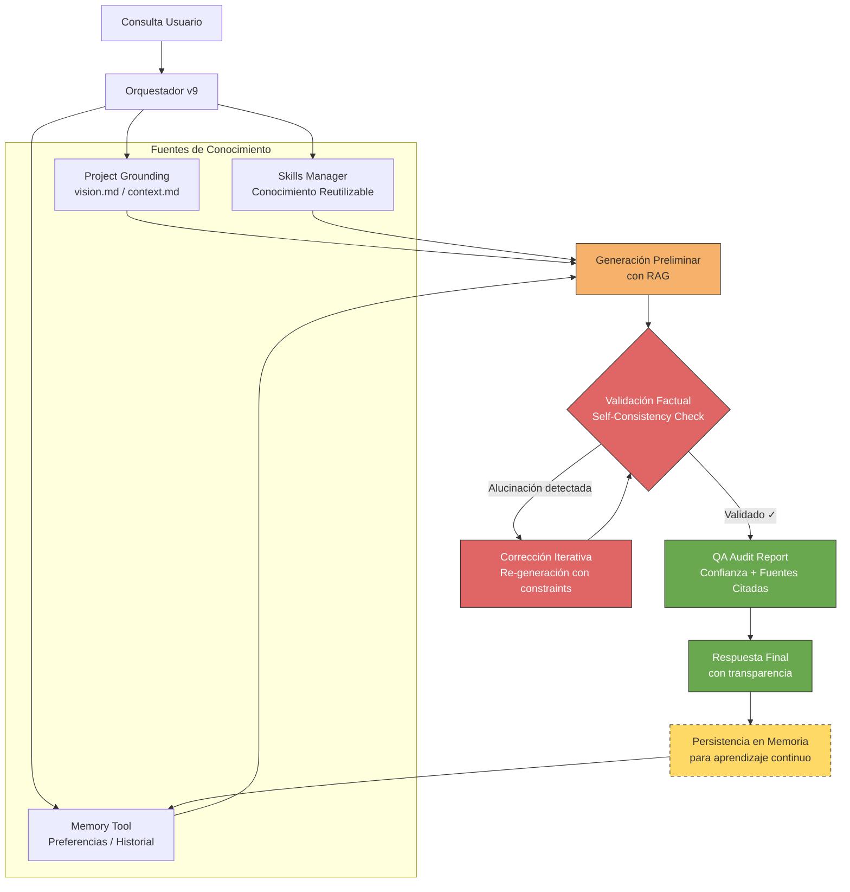

# Diagrama de Flujo v9: Inteligencia Contextual y Anti-Alucinación

### 🔑 Componentes Críticos del Flujo

| Componente | Propósito anti-alucinación | Aplicación en Yari Medic |
|------------|----------------------------|-------------------------|
| **RAG integrado** | La respuesta se genera *siempre* anclada a documentos reales (no "desde cero") | Evita inventar módulos que no existen en `INSTALLED_APPS`. |
| **Self-Consistency Check** | El modelo se auto-cuestiona: *"¿Esta afirmación está respaldada por las fuentes?"* | Detecta si se está sugiriendo un framework ajeno a la arquitectura Django base. |
| **Bucle de corrección** | Si hay alucinación → **re-genera con constraints**, no entrega así | **Crucial:** La validación alimenta la generación antes de que el usuario vea el error. |
| **QA con fuentes citadas** | La respuesta incluye: *"Según vision.md, línea 42..."* | Transparencia total y trazabilidad de decisiones técnicas. |
| **Persistencia → Memoria** | Errores corregidos se guardan para evitar repetir alucinaciones | Aprendizaje incremental sobre las preferencias técnicas del proyecto. |